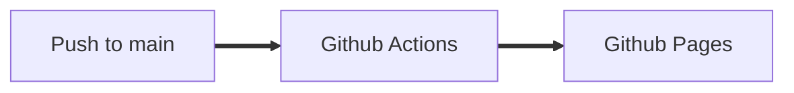

# Bordtennis scoreboard

## Motivation

The new table tennis table arrived. We needed a scoreboard.

## Printscreen

## Stack

- [Vite](https://vitejs.dev/)
- [Vue](https://vuejs.org/)
- [Github Pages](https://pages.github.com/)

## Contribute

See [CONTRIBUTING.md](./CONTRIBUTING.md)

## Production pipeline

