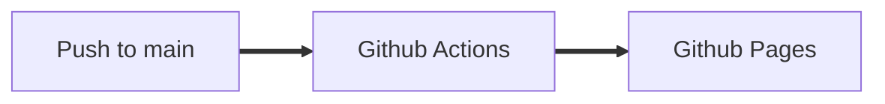

# Bordtennis scoreboard

## Motivation

The new table tennis table arrived. We needed a scoreboard.

## Printscreen

## Prerequisites

- Node 16.x

## Start development server

1. `npm install`
2. `npm run dev`
3. Open link presented in terminal

## Stack

